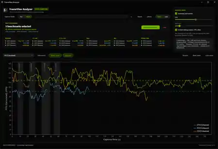
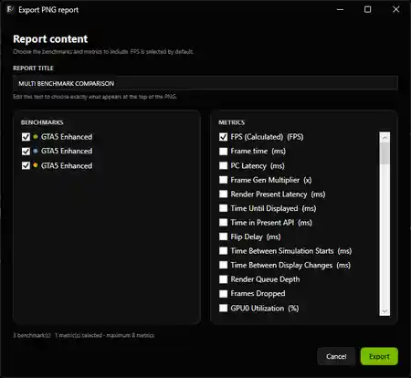

<div align="center">
  
</div>

# FrameView Analyzer

A native Windows desktop application for analyzing and comparing **NVIDIA FrameView** captures and **NVIDIA App performance-overlay logs**.

[](https://github.com/StreckerMX/FrameView-Analyzer/releases/latest)
[](https://dotnet.microsoft.com/)
[](https://github.com/StreckerMX/FrameView-Analyzer/releases/latest)
[](LICENSE)

FrameView Analyzer turns NVIDIA performance CSV captures into an interactive benchmark workspace. Inspect frame-rate and telemetry data over time, compare two runs with the familiar **Pair** workflow, compare **2–8 benchmarks as equal peers** in **Multi**, isolate noisy or loading-screen regions, organize captures in a local Library, and export presentation-ready PNG reports.

## Screenshots

### Pair comparison

<p align="center">
  
</p>

<table>
  <tr>
    <td width="50%" align="center">
      <strong>Light theme</strong><br><br>
      
    </td>
    <td width="50%" align="center">
      <strong>Multi benchmark workspace</strong><br><br>
      
    </td>
  </tr>
</table>

### Library and export workflow

<table>
  <tr>
    <td width="50%" align="center">
      <strong>Benchmark Library</strong><br><br>
      
    </td>
    <td width="50%" align="center">
      <strong>PNG report selection</strong><br><br>
      
    </td>
  </tr>
</table>

<details>
<summary><strong>Exported multi-benchmark report</strong></summary>
<br>
<p align="center">
  
</p>
</details>

## Download

Download the latest stable build from **[GitHub Releases](https://github.com/StreckerMX/FrameView-Analyzer/releases/latest)**.

For the current stable release:

1. Download `FrameViewAnalyzer-v2.2.0-win-x64.zip`.
2. Extract the archive.
3. Run `FrameViewAnalyzer.exe`.

The application is distributed as a **self-contained Windows x64 build**, so installing the .NET runtime separately is not required.

> Windows SmartScreen may show an unknown-publisher warning because the executable is not code-signed.

## Code signing policy

FrameView Analyzer is applying for the SignPath Foundation Open Source Code Signing program. If approved, official release binaries will use **Free code signing provided by SignPath.io, certificate by SignPath Foundation**.

The current application has no telemetry and makes no network calls during normal operation. Signing scope, project roles, privacy guarantees, build provenance, and verification details are documented in the **[Code signing policy](CODE_SIGNING_POLICY.md)**.

## Highlights in 2.2.0

- **Pair and Multi workspaces.** Keep the fast Base vs. Comparison workflow or switch to Multi to compare **2–8 captures as equal peers**.
- **Stable Multi color identity.** Every benchmark keeps the same color across charts, KPI rows, the export selector, and exported PNG reports.
- **Metric-aware visible-range KPIs.** Statistics follow the selected metric and current zoom. FPS includes Average, 1% Low, 0.1% Low, Max, Min, and Visible Time; other metrics use Average, Max, Min, and Visible Time with their units.
- **Direction-aware results.** Multi marks only the winning result with its signed percentage advantage over the runner-up, respecting whether higher or lower is better for the selected metric.
- **Multi Analysis Range.** GPU threshold, trim, and loading-screen / FPS-culler exclusion can be applied to all selected benchmarks together with transactional rollback if any re-analysis fails.
- **Library multi-selection.** Select 2–8 Library captures and open them directly in Multi. Records can also be removed from the Library without deleting their source CSV files.
- **Flexible PNG reporting.** Choose exactly which benchmarks and metrics to export, edit the report title before rendering, and get timestamped filenames that do not collide with previous exports.

## Features

- **Interactive performance charts** with metric switching, hover inspection, cursor-anchored zoom, drag pan, range selection, and automatic zoom.
- **Pair comparison** with Base / Comparison KPI deltas and quick loading from the Benchmark Library.
- **Multi comparison** for 2–8 equal peers with stable colors, shared metric selection, per-benchmark KPI rows, and N-series chart overlays.
- **Visible-range statistics** that recalculate from the current chart window and preserve the visible time range when switching metrics.
- **Automatic analysis tools** for full capture, worst-performance region, most stable region, largest performance drop, and Pair A/B difference analysis.
- **Capture filtering** with GPU-active range detection, edge trimming, transition/loading-screen exclusion, and source-aware FPS outlier handling.
- **NVIDIA App performance-log support** with sampled FPS, NVIDIA-provided 1% Low, GPU/CPU utilization, latency, clocks, temperatures, power, voltage, fan telemetry, and other numeric metrics when present.
- **Benchmark metadata** for game, scene, resolution, graphics preset, upscaler, Frame Generation, Ray Tracing, driver version, notes, and tags.
- **Benchmark Library** with search, filters, sorting, availability tracking, recent Pair comparisons, direct Base/Comparison loading, Multi checkboxes, and non-destructive removal.
- **PNG report export** with benchmark and metric checklists, editable report title, Pair/Multi-aware headers, stable Multi colors, and timestamped suggested filenames.
- **Data exports** for Statistics CSV, benchmark JSON, and portable benchmark packages.
- **Dark and light themes** with native Windows title-bar integration and a responsive full-width dashboard.

## Supported input

FrameView Analyzer supports:

- **NVIDIA FrameView detailed logs**, including standard `*_Log.csv` session files. FrameView FPS is calculated from per-frame timing data.
- **NVIDIA FrameView summary CSVs**, opened as a read-only table.
- **NVIDIA App performance-overlay logs**, including `NVIDIA_App_Performance_Log_*.csv`. These are low-rate telemetry samples rather than per-frame captures, so FPS is aggregated from NVIDIA's sampled FPS values and the exported `FPS 1(%) Low` column is exposed as its own metric.

CSV loading includes tolerant handling for common encoding and numeric-format variations found in real-world captures.

## Typical workflow

1. Select a capture folder or open a supported CSV.
2. Stay in **Pair** to load a Base run and, optionally, a Comparison run.
3. Or switch to **Multi** and select 2–8 captures from the folder or Benchmark Library.
4. Choose a metric, inspect the chart, zoom into a time range, and review the visible-range KPIs.
5. Adjust **Analysis Range** when GPU activity, edge trimming, or loading-screen exclusion needs refinement.
6. Add metadata when you want clearer benchmark names, configuration context, notes, and tags in the Library.
7. Export a PNG report and choose the exact benchmarks, metrics, and report title you want to publish.

## Requirements

- **Windows 11 x64 recommended**
- Self-contained release build: **no separate .NET installation required**
- NVIDIA FrameView or NVIDIA App performance CSV captures

## Building from source

The project targets **.NET 10** and uses WPF.

```powershell
git clone https://github.com/StreckerMX/FrameView-Analyzer.git
cd FrameView-Analyzer

dotnet restore FrameViewAnalyzer.sln
dotnet build FrameViewAnalyzer.sln --configuration Release
dotnet test FrameViewAnalyzer.sln --configuration Release
```

Run the application from source:

```powershell
dotnet run --project src/FrameViewAnalyzer.App --configuration Debug
```

## Technology

- C# / .NET 10
- WPF
- CommunityToolkit.Mvvm
- ScottPlot 5
- CsvHelper
- System.Text.Json
- Serilog
- xUnit

## Project structure

```text
src/
  FrameViewAnalyzer.Core/            Domain models and pure math
  FrameViewAnalyzer.Analytics/       Performance analysis engine
  FrameViewAnalyzer.Infrastructure/  CSV I/O and persistent stores
  FrameViewAnalyzer.App/             WPF application and presentation layer

tests/
  FrameViewAnalyzer.Core.Tests/
  FrameViewAnalyzer.Analytics.Tests/
  FrameViewAnalyzer.Infrastructure.Tests/
  FrameViewAnalyzer.App.Tests/
```

More technical documentation is available in [`docs/`](docs/), including architecture, parity, performance, and release documentation.

## Verification

Version **2.2.0** is covered by the Windows/.NET 10 automated test suite and Release build, plus manual validation of Pair, Multi, Multi Analysis Range, Library multi-selection, FrameView/NVIDIA App metrics, and PNG report selection/export behavior.

Each GitHub release also includes a `.sha256` file for verifying the downloadable ZIP.

## License

FrameView Analyzer is released under the [MIT License](LICENSE).

## Acknowledgements

FrameView Analyzer uses NVIDIA FrameView and NVIDIA App performance-export data together with open-source libraries including ScottPlot, CsvHelper, CommunityToolkit.Mvvm, and Serilog.

This project is independent and is not affiliated with or endorsed by NVIDIA Corporation.
