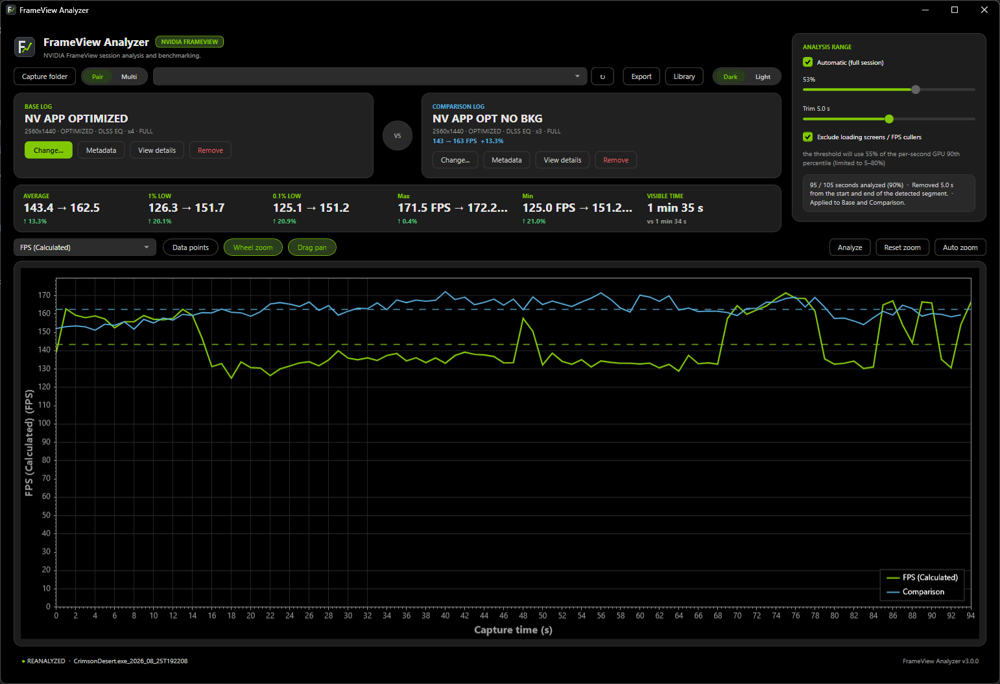
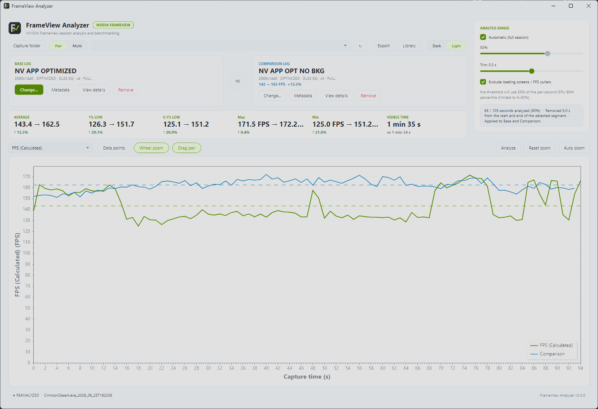
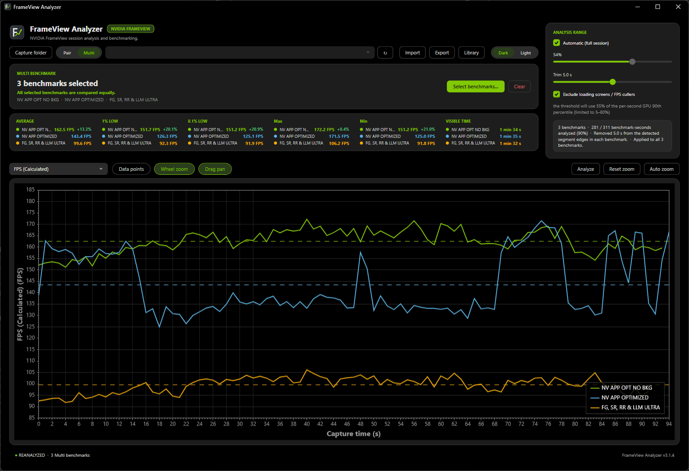
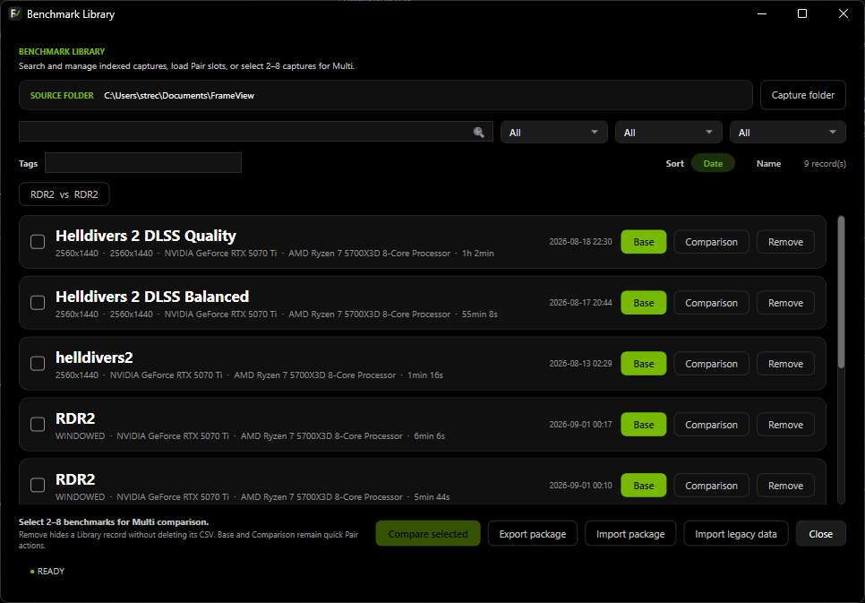
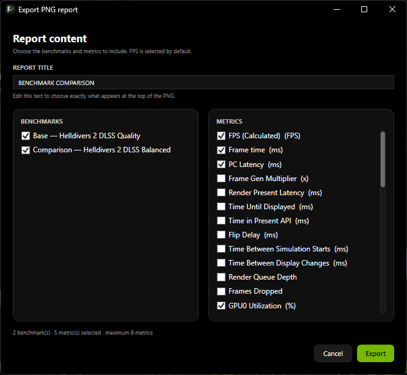
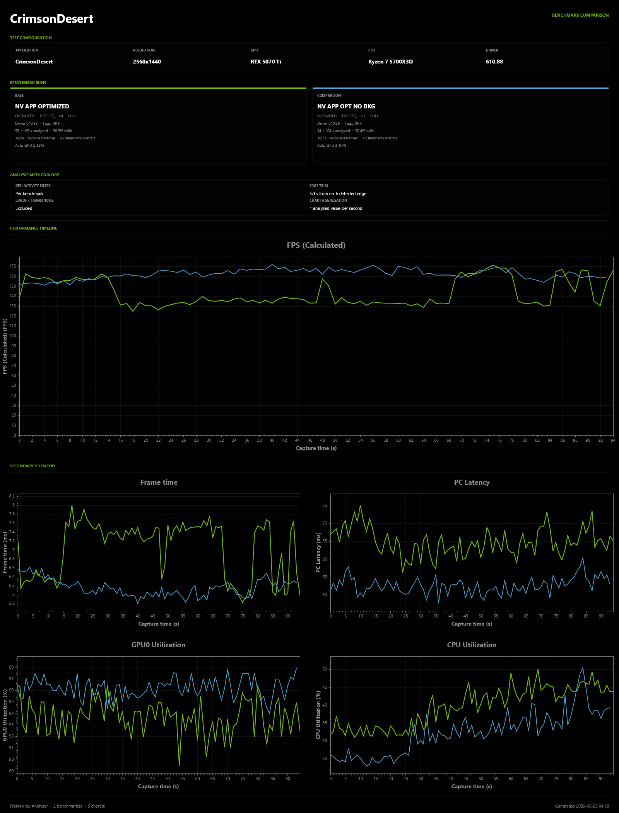

<div align="center">
  
</div>

# Frame Performance Analyzer

A native Windows desktop application for analyzing and comparing **NVIDIA FrameView** captures and **NVIDIA App performance-overlay logs**.

[](https://github.com/StreckerMX/Frame-Performance-Analyzer/releases/latest)
[](https://apps.microsoft.com/detail/9P49TT4BJ798)
[](https://dotnet.microsoft.com/)
[](https://github.com/StreckerMX/Frame-Performance-Analyzer/releases/latest)
[](LICENSE)

Frame Performance Analyzer turns NVIDIA performance CSV captures into an interactive benchmark workspace. Inspect frame-rate and telemetry data over time, compare two runs with the familiar **Pair** workflow, compare **2–8 benchmarks as equal peers** in **Multi**, isolate noisy or loading-screen regions, organize captures in a local Library, and export presentation-ready reports and portable analyzed data.

<p align="center">
  <a href="https://apps.microsoft.com/detail/9P49TT4BJ798">
    
  </a>
</p>

<p align="center">
  <sub><strong>Available now on Microsoft Store</strong> · Store-managed installation and automatic updates for Windows.</sub>
</p>

## Screenshots

### Pair comparison

<p align="center">
  
</p>

<table>
  <tr>
    <td width="50%" align="center">
      <strong>Light theme</strong><br><br>
      
    </td>
    <td width="50%" align="center">
      <strong>Multi benchmark workspace</strong><br><br>
      
    </td>
  </tr>
</table>

### Library and export workflow

<table>
  <tr>
    <td width="50%" align="center">
      <strong>Benchmark Library</strong><br><br>
      
    </td>
    <td width="50%" align="center">
      <strong>PNG report selection</strong><br><br>
      
    </td>
  </tr>
</table>

<details>
<summary><strong>Exported multi-benchmark report</strong></summary>
<br>
<p align="center">
  
</p>
</details>

## Download

### Microsoft Store (recommended)

Install **[Frame Performance Analyzer from Microsoft Store](https://apps.microsoft.com/detail/9P49TT4BJ798)** for the Store-managed Windows installation and update experience.

### GitHub Releases

Portable self-contained builds remain available from **[GitHub Releases](https://github.com/StreckerMX/Frame-Performance-Analyzer/releases/latest)**.

For the current stable release:

1. Download `FramePerformanceAnalyzer-v3.2.0-win-x64.zip`.
2. Extract the archive.
3. Run `FramePerformanceAnalyzer.exe`.

The portable application is distributed as a **self-contained Windows x64 build**, so installing the .NET runtime separately is not required.

> The portable GitHub executable may show a Windows SmartScreen unknown-publisher warning while SignPath Foundation signing is pending. The Microsoft Store build is distributed through Microsoft's Store signing pipeline.

## Code signing policy

Frame Performance Analyzer is applying for the SignPath Foundation Open Source Code Signing program. If approved, official release binaries will use **Free code signing provided by SignPath.io, certificate by SignPath Foundation**.

The current application has no telemetry and makes no network calls during normal operation. Signing scope, project roles, privacy guarantees, build provenance, and verification details are documented in the **[Code signing policy](CODE_SIGNING_POLICY.md)**.

## Highlights in 3.2.0 — Precision Timeline

- **Precision filtering.** One explicit switch chooses between the complete raw capture and the automatic filtering pipeline. The multivariable transition detector combines frame cadence with available GPU, CPU, queue, latency, dropped-frame, and Frame Generation telemetry instead of letting GPU utilization decide alone.
- **Compressed analyzed timeline.** Excluded loading and transition regions are removed from analyzed time instead of leaving artificial gaps in the chart.
- **True frame-level inspection.** Frame points replace the one-second summary curve with real per-frame values. Wide views are visually decimated, while zoom progressively reveals the original detail; frame-level KPIs always use the complete source values.
- **Unified benchmark browser.** Pair, Comparison, Multi, and Library reuse one searchable selector with full-card selection, role colors, source-folder control, and protection against selecting the current Base as its own Comparison.
- **Clearer benchmark identity.** Custom benchmark names from Metadata appear together with the detected capture name in the quick selector, making repeated game captures easy to distinguish.
- **Pair and Multi parity.** Both workspaces share Precision filtering, frame-point statistics, visible-range behavior, busy presentation, zoom/pan, and exports.
- **Interface polish.** Themed scrollbars, exact tick-aligned grid lines, fixed cursor readouts, and distinct **Reset view** / **Fit visible Y** actions keep the dense benchmark interface predictable.
- **Distribution rebranding.** The public product and downloadable files are now **Frame Performance Analyzer**, while NVIDIA FrameView terminology and stable technical identities remain compatible.

## Features

- **Interactive performance charts** with metric switching, a fixed cursor value readout, cursor-anchored zoom, drag pan, range selection, full-view reset, visible-Y fitting, and adaptive FPS scaling.
- **Optional true per-frame timelines** with viewport-aware visual decimation and full-resolution statistics.
- **Pair comparison** with Base / Comparison KPI deltas, direction-aware arrows, and quick loading from the Benchmark Library.
- **Multi comparison** for 2–8 equal peers with stable colors, shared metric selection, per-benchmark KPI rows, and N-series chart overlays.
- **Visible-range statistics** that recalculate from the current chart window and preserve the visible time range when switching metrics.
- **Automatic analysis tools** for full capture, worst-performance region, most stable region, largest performance drop, and Pair A/B difference analysis.
- **Binary raw / Precision filtering modes** with automatic GPU gating, conservative multivariable transition validation, loading-screen exclusion, FPS outlier handling, and compressed analyzed time.
- **NVIDIA App performance-log support** with sampled FPS, NVIDIA-provided 1% Low, GPU/CPU utilization, latency, clocks, temperatures, power, voltage, fan telemetry, and other numeric metrics when present.
- **Benchmark metadata** for game, scene, resolution, graphics preset, upscaler, Frame Generation, Ray Tracing, driver version, notes, and tags.
- **Unified Benchmark Library and selector** with search, filters, sorting, availability tracking, recent Pair comparisons, full-row Base/Comparison/Multi selection, source-folder control, and non-destructive removal.
- **PNG report export** with benchmark and metric checklists, editable report title, Pair/Multi-aware headers, stable Multi colors, current-range rendering, and timestamped suggested filenames.
- **Portable analyzed-data export/import** for current-range CSV and JSON snapshots that can be reopened later in Frame Performance Analyzer.
- **Dark and light themes** with native Windows title-bar integration and a responsive full-width dashboard.

## Supported input

Frame Performance Analyzer supports:

- **NVIDIA FrameView detailed logs**, including standard `*_Log.csv` session files. FrameView FPS is calculated from per-frame timing data.
- **NVIDIA FrameView summary CSVs**, opened as a read-only table.
- **NVIDIA App performance-overlay logs**, including `NVIDIA_App_Performance_Log_*.csv`. These are low-rate telemetry samples rather than per-frame captures, so FPS is aggregated from NVIDIA's sampled FPS values and the exported `FPS 1(%) Low` column is exposed as its own metric.
- **Frame Performance Analyzer portable analyzed-data exports**, allowing previously exported CSV/JSON analysis snapshots to be imported without the original raw capture.

CSV loading includes tolerant handling for common encoding and numeric-format variations found in real-world captures.

## Typical workflow

1. Select a capture folder or open a supported CSV, or import a Frame Performance Analyzer analyzed-data export.
2. Stay in **Pair** to load a Base run and, optionally, a Comparison run.
3. Or switch to **Multi** and select 2–8 captures from the folder or Benchmark Library.
4. Choose a metric, inspect the chart, zoom into a time range, and review the visible-range KPIs.
5. Switch metrics without losing the selected time window when investigating the same event across FPS, frame time, latency, utilization, or other telemetry.
6. Choose **Raw data** when every recorded frame must remain, or enable **Precision filtering** to run the automatic loading/transition pipeline.
7. Enable **Frame points** for real per-frame inspection and zoom further to reveal progressively finer source detail.
8. Add metadata when you want custom benchmark names, configuration context, notes, and tags in the Library and quick selector.
9. Export a PNG report or portable CSV/JSON analyzed-data snapshot. Exports use the current visible time range.

## Requirements

- **Windows 11 x64 recommended**
- Self-contained release build: **no separate .NET installation required**
- NVIDIA FrameView or NVIDIA App performance CSV captures

## Building from source

The project targets **.NET 10** and uses WPF.

```powershell
git clone https://github.com/StreckerMX/Frame-Performance-Analyzer.git
cd Frame-Performance-Analyzer

dotnet restore FrameViewAnalyzer.sln
dotnet build FrameViewAnalyzer.sln --configuration Release
dotnet test FrameViewAnalyzer.sln --configuration Release
```

Run the application from source:

```powershell
dotnet run --project src/FrameViewAnalyzer.App --configuration Debug
```

## Technology

- C# / .NET 10
- WPF
- CommunityToolkit.Mvvm
- ScottPlot 5
- CsvHelper
- System.Text.Json
- Serilog
- xUnit

## Project structure

```text
src/
  FrameViewAnalyzer.Core/            Domain models and pure math
  FrameViewAnalyzer.Analytics/       Performance analysis engine
  FrameViewAnalyzer.Infrastructure/  CSV I/O and persistent stores
  FrameViewAnalyzer.App/             WPF application and presentation layer

tests/
  FrameViewAnalyzer.Core.Tests/
  FrameViewAnalyzer.Analytics.Tests/
  FrameViewAnalyzer.Infrastructure.Tests/
  FrameViewAnalyzer.App.Tests/
```

More technical documentation is available in [`docs/`](docs/), including architecture, parity, performance, and release documentation.

## Verification

Version **3.2.0** is published on Microsoft Store and covered by the Windows/.NET 10 automated test suite, GitHub release-package validation, and Microsoft Store MSIX validation. Manual checkpoints cover normal-load performance, Precision filtering, compressed analyzed time, true frame points, Pair, Multi, the unified browser, metadata labels, zoom/pan, exact grid lines, and FrameView/NVIDIA App metrics.

Each GitHub release also includes a `.sha256` file for verifying the downloadable ZIP.

## License

Frame Performance Analyzer is released under the [MIT License](LICENSE).

## Acknowledgements

Frame Performance Analyzer uses NVIDIA FrameView and NVIDIA App performance-export data together with open-source libraries including ScottPlot, CsvHelper, CommunityToolkit.Mvvm, and Serilog.

This project is independent and is not affiliated with or endorsed by NVIDIA Corporation.
