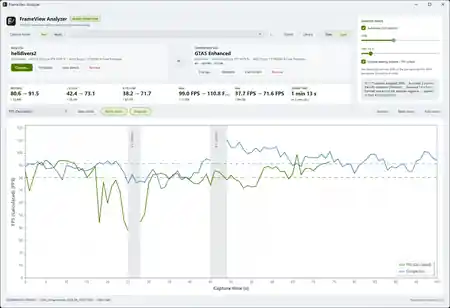
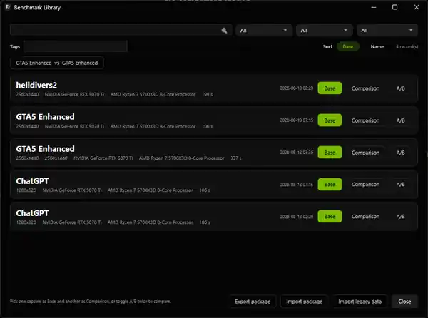
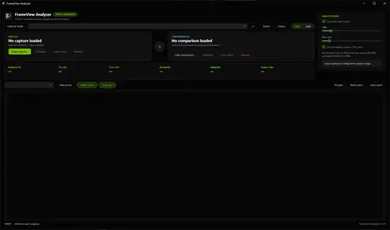
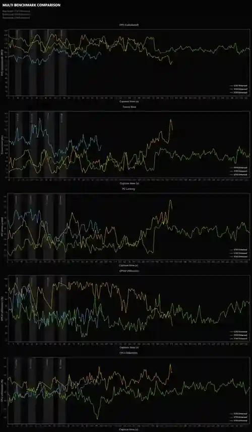

# FrameView Analyzer

A native Windows desktop application for analyzing and comparing **NVIDIA FrameView** captures and **NVIDIA App performance-overlay logs**.

[](https://github.com/StreckerMX/FrameView-Analyzer/releases/latest)
[](https://dotnet.microsoft.com/)
[](https://github.com/StreckerMX/FrameView-Analyzer/releases/latest)
[](LICENSE)

FrameView Analyzer turns NVIDIA performance CSV captures into an interactive performance workspace. Load a benchmark run, inspect frame-rate and telemetry data over time, compare two sessions side by side, isolate problem regions, attach benchmark metadata, and export presentation-ready results.

## Screenshots

### Performance analysis

<p align="center">
  
</p>

<table>
  <tr>
    <td width="50%" align="center">
      <strong>Light theme</strong><br>
      
    </td>
    <td width="50%" align="center">
      <strong>Benchmark Library</strong><br>
      
    </td>
  </tr>
</table>

<details>
<summary><strong>More screenshots</strong></summary>
<br>

#### Empty workspace



#### Exported benchmark report



</details>

## Download

Download the latest stable build from **[GitHub Releases](https://github.com/StreckerMX/FrameView-Analyzer/releases/latest)**.

For the current stable release:

1. Download `FrameViewAnalyzer-v2.1.0-win-x64.zip`.
2. Extract the archive.
3. Run `FrameViewAnalyzer.exe`.

The application is distributed as a **self-contained Windows x64 build**, so installing the .NET runtime separately is not required.

> Windows SmartScreen may show an unknown-publisher warning because the executable is not code-signed.

## Features

- **Interactive performance charts** with metric switching, hover inspection, cursor-anchored zoom, drag pan, range selection, and automatic zoom.
- **Base vs. Comparison workflow** for overlaying two captures and reviewing KPI deltas between benchmark runs.
- **Visible-range statistics** including Average FPS, 1% Low, 0.1% Low, Maximum, Minimum, and visible duration when the source provides enough information.
- **Automatic analysis tools** for full capture, worst-performance region, most stable region, largest performance drop, and largest A/B difference.
- **Capture filtering** with GPU-active range detection, edge trimming, transition/loading-screen exclusion, and FPS outlier handling.
- **NVIDIA App performance-log support** with sampled FPS, NVIDIA-provided 1% Low, GPU/CPU utilization, latency, clocks, temperatures, power, voltage, and fan telemetry when present in the CSV.
- **Benchmark metadata** for game, scene, resolution, graphics preset, upscaler, Frame Generation, Ray Tracing, driver version, notes, and tags.
- **Benchmark Library** with search, filters, sorting, availability tracking, recent comparisons, and direct Base/Comparison loading.
- **Exports** for PNG reports, Statistics CSV, benchmark JSON, and portable benchmark packages.
- **Dark and light themes** with native Windows title-bar integration and a responsive full-width dashboard.

## Supported input

FrameView Analyzer supports:

- **NVIDIA FrameView detailed logs**, including standard `*_Log.csv` session files. FrameView FPS is calculated from per-frame timing data.
- **NVIDIA FrameView summary CSVs**, opened as a read-only table.
- **NVIDIA App performance-overlay logs**, including `NVIDIA_App_Performance_Log_*.csv`. These are low-rate telemetry samples rather than per-frame captures, so FPS is aggregated from NVIDIA's sampled FPS values and the exported `FPS 1(%) Low` column is shown as its own metric.

CSV loading includes tolerant handling for common encoding and numeric-format variations found in real-world captures.

## Typical workflow

1. Select a capture folder or open a supported CSV directly.
2. Load a capture as the **Base** session.
3. Optionally load a second capture as **Comparison**.
4. Choose a metric and inspect the chart or select a visible time range.
5. Use **Analyze** to jump to interesting regions automatically.
6. Add metadata if you want the result stored in the Benchmark Library.
7. Export a report or benchmark data when finished.

## Requirements

- **Windows 11 x64 recommended**
- Self-contained release build: **no separate .NET installation required**
- NVIDIA FrameView or NVIDIA App performance CSV captures

## Building from source

The project targets **.NET 10** and uses WPF.

```powershell
git clone https://github.com/StreckerMX/FrameView-Analyzer.git
cd FrameView-Analyzer

dotnet restore FrameViewAnalyzer.sln
dotnet build FrameViewAnalyzer.sln --configuration Release
dotnet test FrameViewAnalyzer.sln --configuration Release
```

Run the application from source:

```powershell
dotnet run --project src/FrameViewAnalyzer.App --configuration Debug
```

## Technology

- C# / .NET 10
- WPF
- CommunityToolkit.Mvvm
- ScottPlot 5
- CsvHelper
- System.Text.Json
- Serilog
- xUnit

## Project structure

```text
src/
  FrameViewAnalyzer.Core/            Domain models and pure math
  FrameViewAnalyzer.Analytics/       Performance analysis engine
  FrameViewAnalyzer.Infrastructure/  CSV I/O and persistent stores
  FrameViewAnalyzer.App/             WPF application and presentation layer

tests/
  FrameViewAnalyzer.Core.Tests/
  FrameViewAnalyzer.Analytics.Tests/
  FrameViewAnalyzer.Infrastructure.Tests/
  FrameViewAnalyzer.App.Tests/
```

More technical documentation is available in [`docs/`](docs/), including the architecture, parity audit, performance notes, and release documentation.

## Verification

The stable `2.1.0` release is validated by the automated test suite, a clean Release build, manual validation with a real NVIDIA App performance log, and the self-contained win-x64 packaging pipeline.

Each release also includes a `.sha256` file for verifying the downloadable ZIP.

## License

FrameView Analyzer is released under the [MIT License](LICENSE).

## Acknowledgements

FrameView Analyzer uses NVIDIA FrameView and NVIDIA App performance-export data together with open-source libraries including ScottPlot, CsvHelper, CommunityToolkit.Mvvm, and Serilog.

This project is independent and is not affiliated with or endorsed by NVIDIA Corporation.
